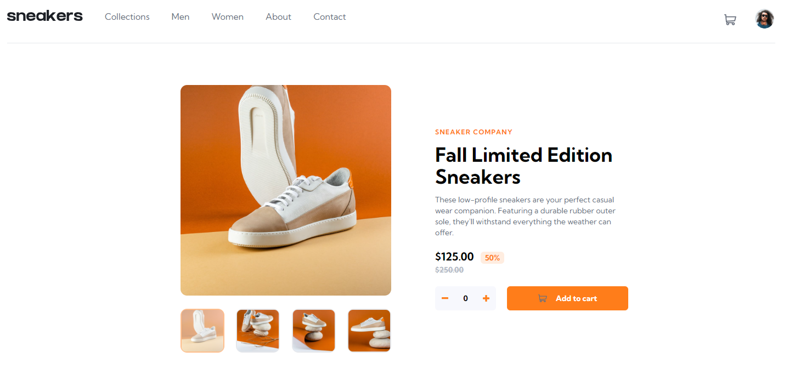
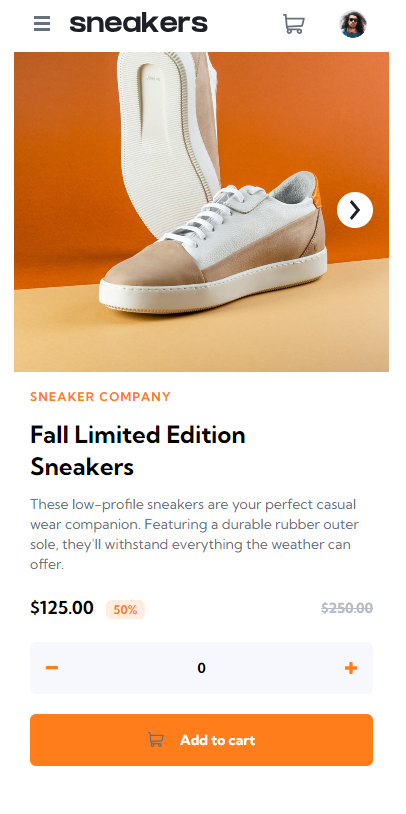

# Frontend Mentor - E-commerce product page solution

This is a solution to the [E-commerce product page challenge on Frontend Mentor](https://www.frontendmentor.io/challenges/ecommerce-product-page-UPsZ9MJp6). Frontend Mentor challenges help you improve your coding skills by building realistic projects.

## Table of contents

- [Overview](#overview)
  - [The challenge](#the-challenge)
  - [Screenshot](#screenshot)
  - [Links](#links)
- [My process](#my-process)
  - [Built with](#built-with)
  - [Useful resources](#useful-resources)
- [Author](#author)

## Overview

### The challenge

Users should be able to:

- View the optimal layout for the site depending on their device's screen size
- See hover states for all interactive elements on the page
- Open a lightbox gallery by clicking on the large product image
- Switch the large product image by clicking on the small thumbnail images
- Add items to the cart
- View the cart and remove items from it

### Screenshot

### Links

- Solution URL: [Solution URL](https://github.com/BerukB/ecommerce-product-page-main)
- Live Site URL: [Live site URL](https://main--capable-mousse-ec5d4b.netlify.app/)

## My process

### Built with

- Semantic HTML5 markup
- CSS
- Flexbox
- Mobile-first workflow
- [Vue JS](https://vuejs.org/guide/quick-start.html#creating-a-vue-application) - JS framework
- [Tailwindcss ](https://tailwindcss.com/) - For styles

### Useful resources

- [Tailwindcss.com](https://tailwindcss.com/) - This helped me for styling the html. I really liked this pattern and will use it going forward.
- [@Codevolution on Youtube](https://www.youtube.com/playlist?list=PLC3y8-rFHvwgeQIfSDtEGVvvSEPDkL_1f) - This is an amazing series of videos which helped me build the modal, using teleport component. I'd recommend it to anyone still learning this concept.

## Author

- Frontend Mentor - [@BerukB](https://www.frontendmentor.io/profile/BerukB)
- LinkedIn - [@beruk-berhanu](https://www.linkedin.com/in/beruk-berhanu/)

